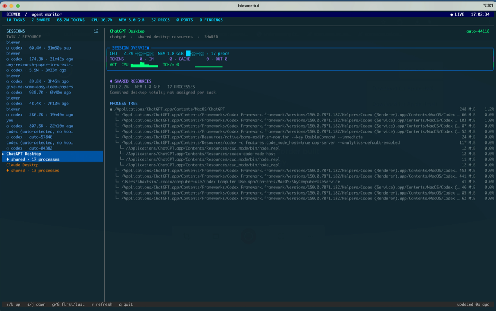

# Biewer

<p align="center">
  <a href="https://github.com/shaktsin/biewer/releases/download/v0.1.0/biewer-demo.mp4">
    
  </a>
</p>

<p align="center">
  <a href="https://github.com/shaktsin/biewer/releases/download/v0.1.0/biewer-demo.mp4">▶ Watch the demo</a>
</p>

Local resource supervisor for Claude Code, Codex CLI, Claude Desktop, and
ChatGPT Desktop.

Biewer shows sessions, token usage, CPU, memory, child processes, ports, and
findings in a two-pane terminal dashboard. It runs locally, requires no API
key, and does not upload prompts or transcripts.

## Features

- Live TUI with project/session details and process trees
- Claude and Codex transcript token accounting
- CPU, memory, process, and listening-port monitoring
- Hook, launch-ID, PID/start-time, and process-ancestry attribution
- Shared resource rows for multiplexed desktop applications
- File-backed storage by default; optional RocksDB backend

## Install

No Go toolchain or native libraries are required. The installer detects the
operating system and CPU architecture, then downloads a precompiled binary:

```sh
curl --proto '=https' --tlsv1.2 -LsSf \
  https://github.com/shaktsin/biewer/releases/latest/download/biewer-installer.sh | sh

source ~/.biewer/bin/env
biewer setup
biewer tui
```

`biewer setup` is idempotent. It starts the daemon, installs Claude/Codex
hooks, and configures Claude's content-disabled local OTLP telemetry.

## Commands

```text
biewer setup                 first-run daemon, hooks, and telemetry setup
biewer tui                   interactive dashboard
biewer watch                 live table/process-tree view
biewer status                one-shot snapshot
biewer sessions --limit 20   session history
biewer stop <session-id>     review a cleanup plan, then terminate processes
biewer enable|disable        start or stop the daemon
biewer hooks install         install Claude hooks and the Codex wrapper
biewer telemetry status      verify Claude telemetry configuration
```

`biewer stop` prints the complete kill plan and asks for confirmation before
terminating anything.

## Technical details

### Attribution

| Marker | Meaning |
|---|---|
| `●` | Confirmed hook, launch-ID, or validated PID ownership |
| `◌` | Unique probable process match |
| `○` | Logical task with tokens but no process ownership |
| `◆` | Shared desktop process tree |

Desktop CPU and memory remain on shared rows because one desktop process can
host multiple tasks. Ambiguous tasks are kept separate instead of guessed.

Optional Codex OTLP export:

```toml
# ~/.codex/config.toml
[otel]
log_user_prompt = false
exporter = { otlp-http = { endpoint = "http://127.0.0.1:4318/v1/logs", protocol = "json" } }
```

Biewer retains identifiers, timestamps, token counters, aggregate metrics, and
validated process identity. Prompt text, responses, tool arguments, and tool
output are ignored.

### Storage and source builds

Portable release binaries use file-backed storage and require no Go toolchain
or native libraries. To build from source, install Go 1.24+ and run:

```sh
make build
make install
biewer setup
```

For RocksDB:

```sh
brew install rocksdb        # Debian/Ubuntu: librocksdb-dev
make install-rocksdb
```

### Development

```sh
make test
make vet
make build-rocksdb
```

Releases use cargo-dist's generic-project support. Go is needed only on the
release builder, not on users' machines:

```sh
dist plan
dist generate
git tag v0.1.0       # match dist.toml
git push origin v0.1.0
```

`.github/workflows/release.yml` is generated but intentionally committed:
GitHub Actions only discovers workflows stored in the repository at
`.github/workflows`. Regenerate it with `dist generate`; do not edit it by
hand.

### Limitations

Biewer currently supports macOS and Linux native mode. Windows, managed
cgroup/VM containment, and disk/network I/O accounting are not implemented.
Detached processes reparented outside a tracked process tree may lose
attribution.

## License

MIT
